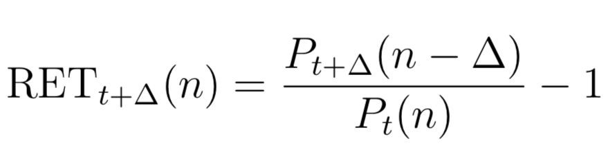
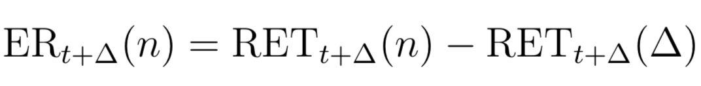
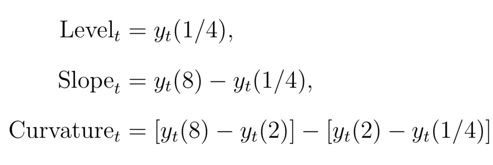

```{r, echo=FALSE}
options(tibble.print_min = 5)
```

# Fixed Income Features Calculations {#rates}

In this chapter, I will construct spot rates, zero coupon bond prices,
excess returns, and yield factors. These features will be used later in
hedging strategies and for general exploration of the data.

The following packages are required in this chapter.

```{r, warning=FALSE, message=FALSE}
library(readr)
library(ratekit)
library(dplyr)
```

## Spot Rates {#spot-rates}

Script) [04-spot-rates-and-prices.R](./R/04-spot-rates-and-prices.R)

Spot rates series can be constructed from the 6 parameters in the rates dataset.
The following formula is used to construct the spot rates. It is integrated
form of the Svensson extension of the Nelson and Siegal approach to calculating
instantaneous forward rates. Svensson added a second hump term to the model
that Nelson and Siegal created. Integrating the instantaneous forward rates gives
us the spot rates.

```{r, echo=FALSE}
knitr::include_graphics("images/spot-rates.png")
```

To reconstruct this, I used a programming concept known as a _function factory_.
This is a specialized function that returns a function. This extends naturally
to this use case because the outer function can accept the time series of the
6 parameters, and the inner function that get's returned is parameterized by
`n`, corresponding to the n-year spot rate at time t. The `spot_rate_factory()`
function lives in `ratekit`, and looks like this.

```{r}
spot_rate_factory
```

As you can see, it accepts the 6 parameters, and returns a function parameterized
by `n`. Because we want to calculate the spot rate for a number of different
years, this parameterized function will be very useful. Below is an example
usage of this concept.

```{r, warning=FALSE, message=FALSE}
# The monthly parameters from the Data chapter
parameters_monthly <- read_rds("data/cleaned/parameters/parameters_monthly.rds")

# The generated function. The function signature is generate_spot_rates(n)
generate_spot_rates <- with(
  data = parameters_monthly, 
  expr = spot_rate_factory(BETA0, BETA1, BETA2, BETA3, TAU1, TAU2)
)

# Calculate the series of 1/12 year, 11/12 year, and 1 year spot rates
spot_rates <- parameters_monthly %>%
  select(date) %>%
  mutate(
    spot_1_month  = generate_spot_rates(1/12),
    spot_11_month = generate_spot_rates(11/12),
    spot_12_month = generate_spot_rates(1)
  )

spot_rates
```

## Zero Coupon Bond Prices

Script) [04-spot-rates-and-prices.R](./R/04-spot-rates-and-prices.R)

n-year zero coupon bond prices can be calculated easily from their corresponding
spot rates. Below is the relationship between the two.

```{r, fig.align='center', echo=FALSE}
knitr::include_graphics("images/zero-prices.png")
```

Like for the spot rates, a function factory was constructed that accepted the
spot rate function, and returned a function that calculates a vector of bond
prices parameterized by `n`.

```{r}
zero_bond_price_factory
```

Using this relationship, the zero coupon bond prices were computed as the following:

```{r}
generate_zero_prices <- zero_bond_price_factory(generate_spot_rates)

zero_prices <- spot_rates %>%
  transmute(
    date, 
    zero_prices_1_month = generate_zero_prices(1/12),
    zero_prices_11_month = generate_zero_prices(11/12),
    zero_prices_12_month = generate_zero_prices(1)
  )

zero_prices
```

## One Month Returns

Script) [05-returns.R](./R/05-returns.R)

The time $t+\Delta$ return on a n-year bond is:

```{r, fig.align='center', echo=FALSE}

```

Using the zero bond prices from before, it is easy to calculate returns. For
example, 1 month returns for 1 year zero coupon bonds can be calculated as:

```{r}
returns <- zero_prices %>%
  mutate(
    zero_prices_12_month_lag = lag(zero_prices_12_month),
    one_month_return = zero_prices_11_month / zero_prices_12_month_lag - 1
  ) %>% 
  select(-zero_prices_1_month, -zero_prices_12_month_lag)

returns
```

## Excess Returns

Script) [05-returns.R](./R/05-returns.R)

Excess returns are calculated over the 1 month treasury, specifically:

```{r, fig.align='center', echo=FALSE}

```

For excess returns, the one month on the n-year bond must be calculated, and the
return on the benchmark (1 month treasury) must be calculated. We already have
1-year bond returns, but we need to calculate our benchmark returns. That can
be done using the same formula as the 1-year returns, but where $P_{t+\Delta}(n-\Delta) = 1$, 
the maturity value.

```{r}
returns_bench <- zero_prices %>%
  mutate(return_benchmark = 1 / lag(zero_prices_1_month) - 1) %>%
  select(date, zero_prices_1_month, return_benchmark)

returns_bench
```

With these two sets of returns in hand, we can calculate excess returns for the
one year bond.

```{r}
excess_returns <- returns %>%
  left_join(returns_bench, "date") %>%
  transmute(date, excess_returns = one_month_return - return_benchmark)

excess_returns
```

## Yield Curve Factors {#yield-curve-factors}

Script) [06-yield-curve-factors.R](./R/06-yield-curve-factors.R)

Finally, the yield curve factors, level, slope, and curvature are calculated as:

```{r, fig.align='center', echo=FALSE}

```

The implementation of these is straightforward from the set of spot rates,
so no example is shown here.