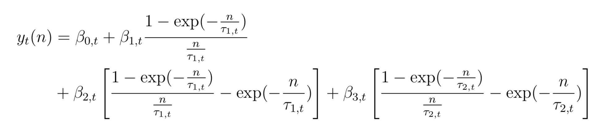
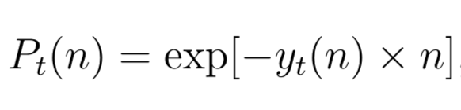

# Fixed Income Features Calculations {#rates}

In this chapter, I will construct spot rates, zero coupon bond prices,
excess returns, and yield factors. These features will be used later in
hedging strategies and for general exploration of the data.

## Spot Rates

Script) [04-spot-rates-and-prices.R](./R/04-spot-rates-and-prices.R)

Spot rates series can be constructed from the 6 parameters in the rates dataset.
The following formula is used to construct the spot rates. It is integrated
form of the Svensson extension of the Nelson and Siegal approach to calculating
instantaneous forward rates. Svensson added a second hump term to the model
that Nelson and Siegal created. Integrating the instantaneous forward rates gives
us the spot rates.

```{r, echo=FALSE}

```

To reconstruct this, I used a programming concept known as a _function factory_.
This is a specialized function that returns a function. This extends naturally
to this use case because the outer function can accept the time series of the
6 parameters, and the inner function that get's returned is parameterized by
`n`, corresponding to the n-year spot rate at time t. The `spot_rate_factory()`
function lives in `ratekit`, and looks like this.

```{r}
spot_rate_factory
```

As you can see, it accepts the 6 parameters, and returns a function parameterized
by `n`. Because we want to calculate the spot rate for a number of different
years, this parameterized function will be very useful. Below is an example
usage of this concept.

```{r}
# The monthly parameters from the Data chapter
parameters_monthly <- read_rds("data/cleaned/parameters/parameters_monthly.rds")

# The generated function. The function signature is generate_spot_rates(n)
generate_spot_rates <- with(
  data = parameters_monthly, 
  expr = spot_rate_factory(BETA0, BETA1, BETA2, BETA3, TAU1, TAU2)
)

# Calculate the series of 1 year, 3 year, and 5 year spot rates
parameters_monthly %>%
  select(date) %>%
  mutate(
    spot_1_yr = generate_spot_rates(1),
    spot_3_yr = generate_spot_rates(3),
    spot_5_yr = generate_spot_rates(5)
  )
```

## Zero Coupon Bond Prices

Script) [04-spot-rates-and-prices.R](./R/04-spot-rates-and-prices.R)

n-year zero coupon bond prices can be calculated easily from their corresponding
spot rates. Below is the relationship between the two.

```{r, fig.align='center', echo=FALSE}

```

